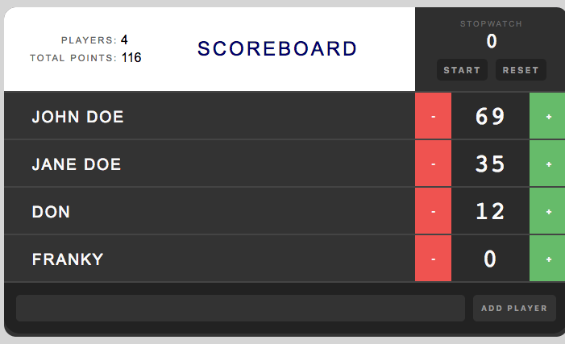

# React Scoreboard
A simple Scoreboard application made with [React JS](https://reactjs.org/) using [JSX](https://reactjs.org/docs/introducing-jsx.html).  
Based on the [Treehouse course React Basiscs](https://teamtreehouse.com/library/react-basics) using some new [ES6 features](http://es6-features.org/). 
 
Using [Babel](https://babeljs.io/) compiler for cross-browser compatibility. 

Main code in [app.jsx](app.jsx).

## Features
- Add / Remove players
- Count up / down score per player
- Displaying statistics (total players / points)
- Stopwatch with Start / Stop and Reset
- Loads inital set of players from object (JSON like)
  
## How to run
1. Clone / Download this repo.
2. Open [index.html](index.html) with your favorite browser
